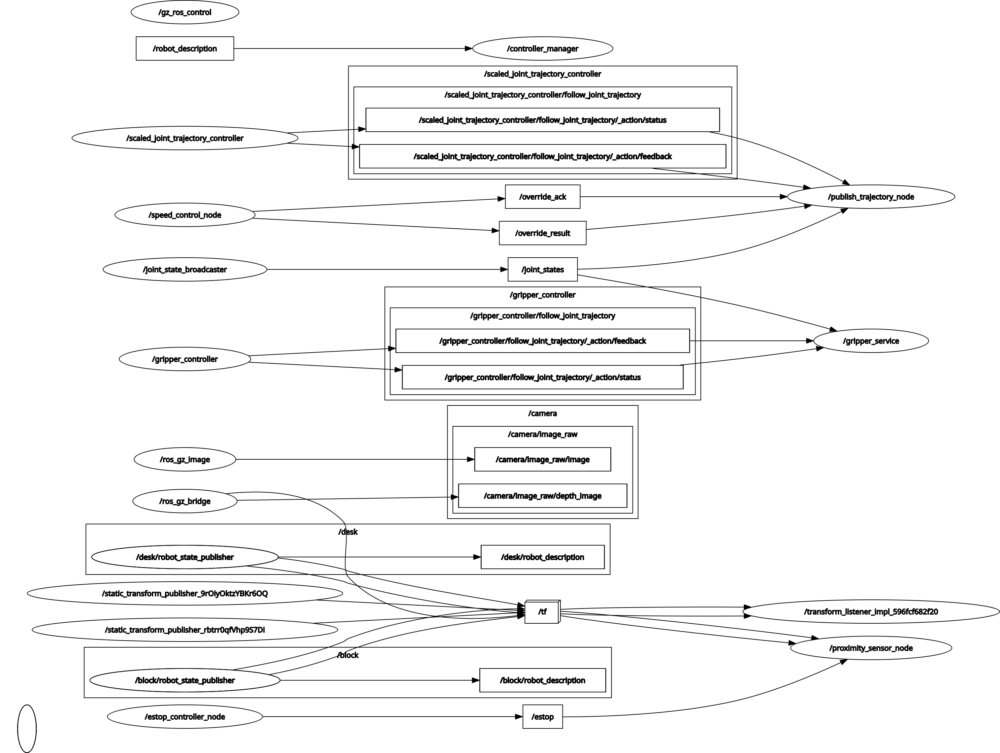

# Speed Controlled Cobot with E-Stop
Matt Kwan\
August 2025


This project implements Proximity-Based Speed Control with Emergency Stop on the UR5 Simulation cobot.

## Installation
1. `git clone` this repo
2. `cd docker`
3. `docker build . -t mattkwan/speed_controlled_ros2_ur5_interface:latest`

## Usage
1. In this repo, run `./open.sh`
2. In an internet browser, go to http://localhost:6081/
3. Click "connect"
4. Double-click the Terminator icon
5. In the Terminator window, run `./make.sh`
6. In the Terminator window, run `./start.sh`
7. You will see a robotic arm move towards a block, slow down, then stop before reaching the block.
8. In a separate Terminator tab/window/split, use the scripts in the `testing` directory in any combination to play out various scenarios live in Gazebo, such as: 
    * moving the block away to have the cobot continue its loop; 
    * turning on/off the estop to watch the cobot freeze in place and resume; 
    * moving the block close by to interrupt the cobot's loop.

## New/(Significantly) Updated Files
```
├── CMakeLists.txt
├── LICENSE
├── README.md
├── clean.sh
├── docker
│   ├── Dockerfile
│   └── entrypoint.sh
├── launch
│   ├── estop_controller.launch.py
│   └── sim_with_trajectory.launch.py
├── make.sh
├── nodes
│   ├── estop_controller_node
│   └── proximity_sensor_node
├── open.sh
├── package.xml
├── src
│   ├── publish_trajectory_node.cpp
│   └── speed_control_node.cpp
├── start.sh
├── testing
│   ├── estop_off.sh
│   ├── estop_on.sh
│   ├── move_block_away.sh
│   ├── move_block_close.sh
│   └── readme.md
```

## Node Diagram



## Additional Notes

This repo is forked from the [UR5 Simulation Repository](https://github.com/pla10/ros2_ur5_interface/tree/main). Their readme is included in full below and can be used as additional reference for installation, usage, background, etc. As such, this fork is protected under the MIT License as did the original.

Credit: much of the code in this repo was inspired by or adapted from products of AI tools such as Gemini and ChatGPT. Some new code portions are adapted from existing snippets from the UR5 repo from which this repo is forked.

This project is a work-in-progress for practice purposes only. That being said, feel free to reach out with questions or concerns!

# UR5 Simulation Repository

This repository provides **auxiliary resources** to help students and robotics enthusiasts visualize simulations and create new nodes for their projects. It complements the [**pla10/ros2_ur5_interface**](https://hub.docker.com/r/pla10/ros2_ur5_interface) Docker image, which delivers a pre-configured ROS 2 Jazzy environment tailored for the **UR5 manipulator robot**.
This repo is included, at its latest release, in the /home/ubuntu/ros2_ws of the [**pla10/ros2_ur5_interface**](https://hub.docker.com/r/pla10/ros2_ur5_interface) Docker image.

The resources in this repository were developed for the **"Fundamentals of Robotics" course** at the **University of Trento** and aim to streamline project development and learning.

---

## Features
- **Simulation visualization**: Tools to interact with the UR5 simulation in a graphical environment.
- **Example ROS 2 nodes**: Includes a sample node for trajectory publication to get you started.
- **Launch files**: Ready-to-use launch files for interacting with the simulated or real UR5 robot.
- **Bash scripts**: Simplifies running the UR5 simulation and ROS 2 environments with pre-defined commands.

---

## Repository Structure
```plaintext
.
├── launch/
│   ├── sim.launch.py                     # Launch file to simulate the UR5 robot in gazebo
│   ├── interface.launch.py               # Launch file to interact with simulated and real UR5 robot
├── src/
│   ├── gripper_service.cpp               # Node that provides a service to open/close the gripper
│   ├── publish_trajectory_node.cpp       # Example node for trajectory publication
├── config/
│   ├── ur_controllers.yaml               # Configuration file for the UR5 controllers
├── params/
│   ├── ur5_bridge.yaml                   # Parameters file for the Gazebo bridge
├── gripper/
│   ├── open.script                       # Script to open the soft robotics gripper
│   ├── close.script                      # Script to close the soft robotics gripper
│   ├── neutral_from_open.script          # Script to move the gripper to a neutral position from the open position
│   ├── neutral_from_closed.script        # Script to move the gripper to a neutral position from the closed position
├── models/
│   ├── desk.urdf.xacro                   # URDF file that defines the desk where the UR5 is mounted
│   ├── desk.config                       # Config file auxiliary to the SDF file
│   ├── ur_gz.ros2_control.xacro          # URDF file that defines the UR5 robot with ROS 2 control
│   ├── ur_gz.urdf.xacro                  # URDF file that defines the UR5 robot
│   ├── soft_robotics_gripper.urdf.xacro  # URDF file that defines the soft robotics gripper
│   ├── camera.sdf                        # SDF file that defines the RGBD camera
│   ├── block.urdf.xacro                  # URDF file that defines a block
│   ├── block.config                      # Config file auxiliary to the SDF file
│   ├── meshes
│   |   ├── desk.stl                      # STL file with the 3D mesh of the desk
│   |   ├── base.stl                      # STL file with the 3D mesh of the base of the soft robotics gripper
│   |   ├── link1.stl                     # STL file with the 3D mesh of the first link of the soft robotics gripper
│   |   ├── link2.stl                     # STL file with the 3D mesh of the second link of the soft robotics gripper
│   |   ├── X*-Y*-Z*.stl                  # STL files with the 3D mesh of the blocks
├── docker/
│   ├── Dockerfile                        # Dockerfile for the ROS 2 UR5 interface docker image
│   ├── entrypoint.sh                     # Entrypoint script used in the docker
├── scripts/
│   ├── ur5.sh                            # Starts the URSim simulator container
│   ├── ros2.sh                           # Starts the pla10/ros2_ur5_interface container
├── worlds/
│   ├── empty.world                       # Gazebo world file with plugins for the UR5 simulation
├── rviz/
│   ├── ur5.rviz                          # RViz configuration file
├── README.md                             # Project overview and instructions
```

---

## Prerequisites
- **Docker**: Ensure Docker is installed and running on your system.
- **Docker Network Setup**: Create a Docker network named `ursim_net` before running the containers:
  ```bash
  docker network create --subnet=192.168.56.0/24 ursim_net
  ```

## Simulation
You can choose between two simulation environments:
- **URSim**: A graphical simulation environment for the UR5 robot that uses a dedicated Docker container. This solution is preferred since it is lightweight and simulates the real connection with the robot. But with this solution you can simulate ONLY the robot, not the environment (no cameras, external sensors, etc).
- **Gazebo**: A more complex simulation environment that uses the ROS 2 Gazebo bridge and is included in the [pla10/ros2_ur5_interface](https://hub.docker.com/r/pla10/ros2_ur5_interface) Docker image.

## How to Use (URSim)
### 1. Start the UR5 Simulator
Run the URSim container using the provided bash script:
```bash
bash scripts/ur5.sh
```
This starts the [pla10/ursim_e-series](https://hub.docker.com/r/pla10/ursim_e-series) Docker container for UR5 simulation. Access the simulator via your browser at [http://localhost:6080](http://localhost:6080).


To prepare the robot to work with ROS2 you need to go to the program tab and add the URCaps > External Control.

---

### 2. Start the ROS 2 Interface
Run the ROS 2 container using the provided bash script:
```bash
bash scripts/ros2.sh
```
This starts the [pla10/ros2_ur5_interface](https://hub.docker.com/r/pla10/ros2_ur5_interface) container. Access the environment via noVNC at [http://localhost:6081](http://localhost:6081).


The user password is "ubuntu".

---

### 3. Run ROS 2 Nodes
- Open a terminal inside the ROS 2 container (accessible via noVNC).
- Navigate to the ROS 2 workspace:
  ```bash
  cd /home/ubuntu/ros2_ws
  ```
- Source the ROS 2 setup:
  ```bash
  source install/setup.bash
  ```
- Launch the control nodes using the provided launch files:
  ```bash
  ros2 launch ros2_ur5_interface interface.launch.py
  ```

## How to Use (Gazebo)
### 1. Start the UR5 Gazebo Simulation
Run the ROS 2 container using the provided bash script:
```bash
bash scripts/ros2.sh
```
This starts the [pla10/ros2_ur5_interface](https://hub.docker.com/r/pla10/ros2_ur5_interface) container. Access the environment via noVNC at [http://localhost:6081](http://localhost:6081).

- Open a terminal inside the ROS 2 container (accessible via noVNC).
- Navigate to the ROS 2 workspace:
  ```bash
  cd /home/ubuntu/ros2_ws
  ```
- Source the ROS 2 setup:
  ```bash
  source install/setup.bash
  ```
- Launch the simulation nodes using the provided launch files:
  ```bash
  ros2 launch ros2_ur5_interface sim.launch.py
  ```

### 2. Run ROS 2 Example Node
Run the trajectory publication node to visualize the UR5 robot moving:
```bash
ros2 run ros2_ur5_interface publish_trajectory_node
```


<br><br>

## Connect to the real UR5 robot
Check the robot's IP address by following these steps:
1. Press the burger menu button on the top right of the robot's teach pendant.
2. Select "Settings".
3. Navigate to "System" > "Network".
4. Check the IP address.


<br><br>
   
Check under the installation tab if in the URCaps > External Control your IP address is the same as the one you are using to connect to the robot.


<br><br>

To connect to the real UR5 robot you need to specify the IP address of the robot when launching the interface.launch.py file. You can do this by adding the following argument to the launch command:
```bash
ros2 launch ros2_ur5_interface interface.launch.py robot_ip:=<robot_ip>
```

<br><br>

<p style="display: block; margin-left: auto; margin-right: auto;">
 
 
</p>

---

## Contributions
Students and contributors are welcome to improve this repository by adding new nodes, launch files, or other auxiliary tools. Feel free to open issues or submit pull requests.

---

## License
This project is licensed under the MIT License. See the [LICENSE](LICENSE) file for details.
